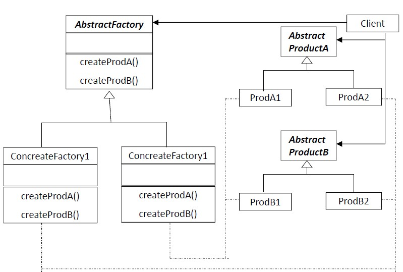

# Abstract Factory
Provide an interface for creating families of related or dependent objects without specifying their concrete classes.

# When to use Abstract Factory
Use an Abstract Factory when:
* The system should be independent of how its products are created, composed and represented
* The system should be configured with one of multiple families of products
* You want to reveal only the interface and not the implementation of a class library of products

# Structure
